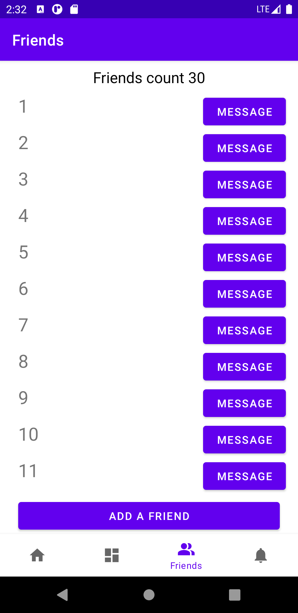
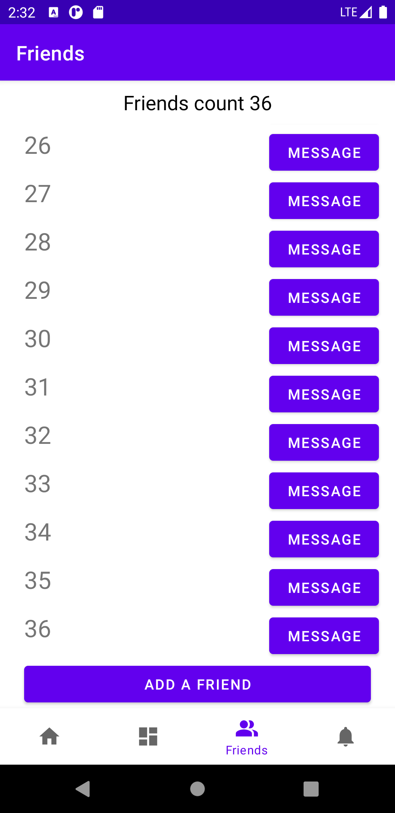
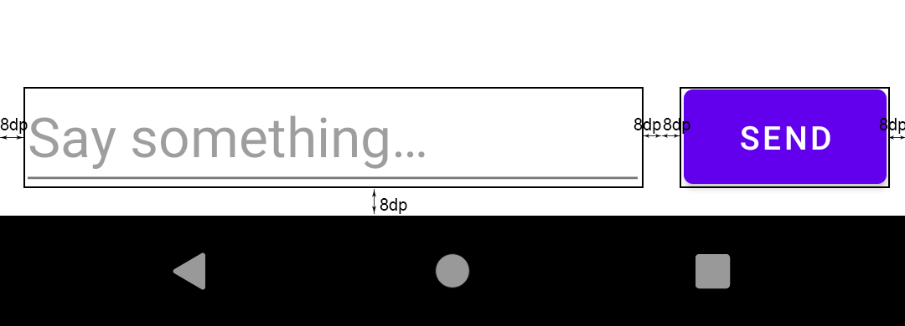

## 具体功能与要求

这个 app 的 main activity 中采用 Navigation 在 4 个 Fragment 之间切换。

其中主要需要实现的是 Friends 这个 Fragment。这一屏中从上到下依次为：

- TextView，用以动态显示目前朋友的个数
- RecyclerView，朋友列表，显示所有的朋友
- Button，按按钮可以增加一位朋友

初始时，自动创建 30 位朋友，名字为 1 至 30。此后每增加一位朋友，其名字都应为**已有的朋友数量 +1**。如已有 38 位朋友，则新增的朋友名字应为 39。该 RecyclerView 应当可以动态更新，并将新朋友加入到列表的末尾，同时保持滚动位置**不变**。

如上，左图是已有 36 位朋友，并将 RecyclerView 滚动至最末尾时的屏幕截图；右图是在左图状态下再次按下新增朋友按钮后（未做滑动）的屏幕截图。

列表中每位朋友名字右侧都有一个 "MESSAGE" Button。按下这个按钮可以通过 Intent 打开一个新的 activity。其布局如下：

此界面标题应显示为 Talk with X，其中 X 为选择聊天的朋友名字（即所按下的 MESSAGE 按钮对应的那位朋友的名字）。同时在标题栏需要显示返回按钮。最下方有一个 EditText 与一个 Button。其布局细节如下：

且**这两个元素垂直方向上中线对齐**。EditText 中字体大小为 24sp，Button 中字体大小为默认。

此时按下标题栏的返回按钮可以回到 main activity 中的 friends fragment，且保持 RecyclerView 的滚动位置**不变**。

## Requirements

要求实现上面所述的效果。

要求采用 MVVM 模式，且在切换 fragment 后，朋友列表的数据不丢失。

要求仅完成 TODO List（见下）中规定的未完成部分，不随意修改已有代码，但允许添加或修改依赖、导入包、注释等。

不要求在 main activity 被销毁后依然保留朋友列表的数据。

不要求在切换 fragment 后依然保留 RecyclerView 的滚动位置。

不要求实现额外功能。

## TODO List

- com.example.learningmodule
  - ui.friends
    - FriendsFragment.kt
      - (18, 8) // TODO: Implement this function
      - (26, 16) // TODO: Complete constructor
      - (31, 16) // TODO: Implement this function
      - (50, 58) // TODO: by what?
      - (60, 12) // TODO: Implement onCreateView
    - FriendsViewModel.kt
      - (17, 8) // TODO: Implement the following members of FriendsViewModel
  - MainActivity.kt
    - (17, 12) // TODO: Implement onCreate
  - MessageActivity.kt
    - (15, 12) // TODO: Implement onCreate
- layout
  - activity_message.xml
    - (9, 14) // TODO: Set the attributes these two elements should have
  - friends_item.xml
    - (5, 14) // TODO: Fill in the blank

## Have problems?

如对题目有疑问请联系**@保安**（QQ: 869398327）