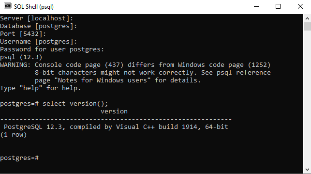

# Back End, Let's Go!

这里是求是潮2021春季纳新二面 **后端** 题目。
在这个题目中，你将会学习：

1. 表格与 SQL 基础知识
2. 数据库环境的初始化与建表
3. Go 语言基础
4. 使用 GORM 操纵数据库中的数据

这道题目无需任何基础即可进行作答。
当然，对于不同基础的人，解决此题所花费的时间也会有所不同：

### 困难
- 几乎没有编程相关的基础知识

### 普通
- 学习过至少一门编程语言

### 简单
- 掌握面向对象的程序设计相关知识
- 拥有配置环境的经验

准备好了吗？Let's Go!  

## 0. 表格与查询

不知道你是否使用过 EXCEL 文档。一个 EXCEL 文档中的`学生`**表格**会是下面的样子：  

`“学生”表格`

|       |   姓名   |   性别   | 年龄 |   当前班级   | 大一所在班级 |   学号   |
| :---: | :---: | :---: | :---: | :---: | :---: | :---: |
| 1 | 小张 | 女 | 20 | 计科1901 | 工信1918 | 3190101234 |
| 2 | 小胡 | 男 | 19 | 工信2017 |          | 3200105678 |
| 3 | 小王 | 女 | 21 | 机械1802 | 机材1801 | 3180109012 |

显然，第一行与第一列中的单元格，相比于其他单元格，它们的“地位”是不同的。除了第一行与第一列以外，其余的每一个单元格都存储了**数据**。
在这个表中，每一**列**存储的都是一类信息，比如姓名、性别信息等等。而每一**行**存储的则是一个人的基本信息。
行与列是这个表基础的特性。我们平常查询 EXCEL 表格的时候，可以有多种“看法”。请思考一下，如果你想查询某种信息，你会如何“看这个表”。  

#### 查询小张的所有信息
1. 在“姓名”**列**里找到“小张”所在的单元格（为了简化问题，我们不妨假设表里只有一个“小张”）
2. 查看该单元格所在**行**的**所有**信息

#### 查询小张的当前班级
1. 在“姓名”**列**里找到“小张”（为了简化问题，我们不妨假设表里只有一个“小张”）
2. 查看“小张”所在的**行**，从该行里找到“当前班级”**列**中的单元格

#### 查询**所有**年龄大于19的人的姓名
1. 在“年龄”列里找到所有大于19的单元格
2. 查看这些单元格所在的**行**，从这些行里找到“姓名”**列**中的单元格

我们不难发现，这些较为简单的查询过程往往可以归纳为以下两部分：

| 目标（未知信息） | 条件（已知信息） |
| :---: | :---: |
| （所有信息） | 姓名=小张 |
| 当前班级 | 姓名=小张 |
| 姓名 | 年龄>19 |

### 认识 SQL

当我们尝试使用计算机对表格进行查询时，就不得不使用一种*计算机语言*对数据库进行查询。这种计算机语言就是SQL。
SQL 的全称是 Structured Query Language，结构化查询语言。也许你之前见过C语言，而我们这里提到的SQL与C语言同为编程语言，但它们的“长相”还是不太一样。  
在计算机里，我们一般都使用英文。我们不妨用英文把刚刚的表格改写一下：  

`table "students"`

| id |   name   | gender | age | current_class | freshman_class | zju_id |
| :---: | :---: | :---: | :---: | :---: | :---: | :---: |
| 1 | 小张 | 女 | 20 | 计科1901 | 工信1918 | 3190101234 |
| 2 | 小胡 | 男 | 19 | 工信2017 |          | 3200105678 |
| 3 | 小王 | 女 | 21 | 机械1802 | 机材1801 | 3180109012 |

在数据库中，我们需要一列**互不相同** (unique) 的信息，来指明我们到底要操作什么。其他单元格可以任意地出现重复，但这一列一定不能重复。
在上面展示的表格中，充当这个唯一信息的一列就是`id`列，它以**自增** (auto increment) 的方式，从1开始，持续上升。
由于这一列在表格中的特殊地位，我们称 `id`是 `students` 表的**主键** (primary key)。 一个表中只能有一个主键。主键不一定是自增的，但该表中不同行的主键必须是互不相同的。  

那么，在上一节中，我们提到的三次查询可以分别写作以下三个SQL语句：  
```sql
SELECT * FROM students WHERE name='小张';
SELECT current_class FROM students WHERE name='小张';
SELECT name FROM students WHERE age>19;
```
其中，`students`是表格的名字。事实上，在一个**数据库**中，存在着很多**表格**。student 表是数据库中的一个表格。
第一条 SQL 语句中的`*`的含义是“所有”。  

我们发现，查询的**目标**被写在了`SELECT`关键字后面，查询的**条件**被写在了`WHERE`关键字后面。整个 SQL 语句读起来，非常接近自然语言。  
这三条 SQL 语句的结果分别如下：  

```sql
SELECT * FROM students WHERE name='小张';
/*
 id | name | gender | age | current_class | freshman_class |   zju_id   |
----+------+--------+-----+---------------+----------------+------------+
  1 | 小张  |  女    |  20 | 计科1901      | 工信1918        | 3190101234 
*/

SELECT current_class FROM students WHERE name='小张';
/*
 current_class 
---------------
 计科1901
 */


SELECT name FROM students WHERE age>19;
/*
 name 
------
 小张
 小王
 */
```

至此，你已经成功入门了SQL。以下内容需要你自己进行学习与思考：

1. 以上介绍的内容**查询**语句。后端开发者与数据库进行交互的过程中，他们除了**查询**操作，还会进行**增添**、**删除**、**修改**，这四个操作合称**增删改查**，是后端开发的基石。你需要在互联网上搜索与它们相关的相关信息（如，搜索关键词：SQL删除语句），进行学习。
2. 思考一下，你在使用EXCEL的时候，会对表格进行什么样的查询操作？如果存在多个表格，它们之间存在关系，那么又会如何进行查询呢？

以上两道题目不需要你进行作答，但请一定按照题目要求进行学习或思考。这将对你顺利完成后续的题目有帮助。  


## 1. 安装数据库与建表

### 📝1-1 数据库初始化

常用的数据库有非常多，诸如微软的 SQL Server，甲骨文的 MySQL等等。这里推荐安装开源且强大的[PostgreSQL](https://www.postgresql.org/)，作为完成本题的数据库。如果你不愿意使用 PostgreSQL，以下列表可供你参考：  
- 可以选择：
  - MariaDB
  - MySQL
  - 其他关系型数据库
- 不能选择：
  - MongoDB 等非关系型数据库
  - MinIO 等对象存储
  - 其他非关系型数据库

接下来的题目与指导将以 PostgreSQL 为例。如果你选择使用其他关系型数据库，请你提交与该题目需求相符的解决方案。  

#### 任务
首先，安装数据库。登录数据库并在命令行中执行`SELECT version();`，获取 PostgreSQL 的版本信息，并截图上传。若使用其他数据库，请用该数据库的方法获取其版本信息，以下不再赘述。  
下图为在 Windows 环境下以`postgres`用户登录的示例图：  



#### 提示
由于不同操作系统（如 macOS，Windows，Linux） 安装 PostgreSQL 的方法不尽相同，因此，若在安装过程中遇到问题，请参考 [postgresql-download](https://www.postgresql.org/download/) 以及 [postgresql-tutorial](https://www.postgresqltutorial.com/postgresql-getting-started/).  

#### 再提示
你可能完全没有完成以上任务的经验。别小看“安装数据库”这五个字，为了达成这个目的，你需要去搜索引擎上查找 PostgreSQL 的下载地址，也许在下载过程中还会遇到下载缓慢的问题。在安装完成后，你甚至可能找不到 PostgreSQL 被装到哪里了。  
事情到这里还没有结束。即使你找到了 PostgreSQL ，你也许也无法正确地使用它。最简单的问题是：如何登陆 PostgreSQL？  
我们非常理解初学者的感受。但，所有知识的积累，都不得不经历从不懂到懂的过程。无论你是否能成功加入求是潮，*查询资料*与*寻求帮助*这两个能力一定会对你大有裨益。  
对于初学者，请参考以下两条建议：

1. 善用搜索引擎。比如，你下载好了 PostgreSQL ，但你对接下来的操作一无所知；这时你应该去进行搜索。搜什么？搜关键字：`PostgreSQL 初始化`。一般而言，我们使用搜索引擎时，都会输入关键字。如果你希望查找与 **PostgreSQL** 的 **初始化** 相关的信息，那么你就应该输入这两个关键字，并用空格将它们两个隔开。
2. 寻求帮助。你可以在二面 QQ 群里询问相关问题。我们会及时做出解答。


### 📝1-2 建表并添加记录

光有 PostgreSQL 还不行，里面的数据才是有价值的东西，所以接下来，你需要开始建表，并添加几条记录。当然，达成这一目的的手段有很多，比如通过命令行直接输入 SQL 指令、执行 SQL 脚本、使用可视化的界面等等。这里要求以 SQL 脚本的形式建表并添加数据，希望你能了解一下 SQL 语句，动手写几行。

#### 任务
根据以下字段信息，编写`1-2.sql`脚本，实现创建`students`表格，并向该表格中插入上文提到的对应三条信息。

| 字段           | 类型      | 要求                 |
| -------------- | --------- | -------------------- |
| id             | INT  | 自增，主键，非空     |
| name           | VARCHAR() | 长度不超过50，非空 |
| age            | INT       | 非空                 |
| gender         | INT       | 非空               |
| current_class  | VARCHAR() | 长度不超过255，非空  |
| freshman_class | VARCHAR() | 长度不超过255        |
| zju_id         | BIGINT    | 唯一，非空        |

注：数据库存储性别的方式有很多。你可以自行规定一种方式，如 1 代表男性 等。

#### 提示
创建数据库 -> 连接数据库 -> 执行SQL脚本  
可以参考 [pg-create-table](https://www.postgresqltutorial.com/postgresql-create-table/)，并灵活使用搜索引擎。  

## 2. Go 语言入门

Go 是一门开源的编程语言，由谷歌公司开发。  
Go 语言是一门极简主义的语言，且与C非常相似。Go 语言非常适合开发网络应用，特别是后端应用。你将会在未来的学习中理解这些。  

这里给出 Go 语言的官方入门教程：[go-doc](https://tour.go-zh.org/)
如果你选择按照官方入门教程进行学习，建议你完成`基础`章节的学习。


### 📝2-1 配置 Go 语言环境

#### 任务
配置 Go 语言环境，于命令行执行 `go version`，确认是否成功安装并截图。

### 📝2-2 新建 Go 语言项目

#### 任务
创建一个 Go 语言项目。后续的题目将在这个项目里完成。


## 3. 将数据库信息映射到对象 (ORM)

ORM 是 Object Relational Mapping 的缩写，即对象关系映射。通过把数据库里的关系、数据映射到对象上，使得开发者能通过面向对象的设计模式管理操纵数据。  

### 📝3-1 使用 GORM 提供的驱动连接到数据库

[gorm](https://gorm.io/index.html) 是一个 Go 语言的 ORM 框架。它实现了 ORM 的思想。  
如果我们的 Go 语言程序需要与数据库进行交互，那么在此之前，我们必须使程序能够连接到数据库。  

#### 任务
使用 GORM 的驱动，将你的 Go 程序连接到你配置好的数据库。  

#### 提示
你可以从 [gorm-connect-to-database](https://gorm.io/docs/connecting_to_the_database.html) 中获得帮助。  
这个网页是 GORM 文档的一部分。在接下来的步骤中，你会经常从这个文档中获得帮助。  

### 📝3-2 使用 GORM 与数据库进行交互

程序和数据库交互的方式有很多。我们可以直接执行 SQL 语句，就像我们在命令行中输入 SQL 语句、或使用 SQL 脚本一样，去与数据库进行交互。  

```go
rows, err := db.Raw("SELECT * FROM students WHERE name = ?", "小张").Rows()
defer rows.Close()
```

`小张`会替换掉 SQL 查询语句中的 `?`。这样，符合查询条件的第一行就被取了出来，并存储在`rows`对象中。  
如果想要访问所有符合条件的行，你需要这样写：  

```go
for rows.Next() {
  // do something
}
```

如果你使用过 Python 的`Django`框架，就会发现它的查询写法与上述过程非常相似。  

然而，以上的写法存在一些弊端。在程序设计中，我们往往与对象打交道：  

```go
type Student struct {
	ID            uint
	Name          string
	Age           int
	Gender        int
	CurrentClass  string
	FreshmanClass string
	ZjuId         int64
}
stu := Student{ID: 3200105359, Name: "小张", Age: 17}
```

在这里，stu 就是一个对象。而上面描述的数据库查询，与对象并没有构建出任何关联。这使得我们的开发过程变得困难。我们希望达成的目的是，直接从数据库里取出我们需要的对象。这样，我们的开发就会变得非常方便。  
GORM 框架实现了这个需求。如果我们想要取出数据库中第一个符合条件的行，使用 GORM，我们可以使用以下语句：  

```go
stu := Student{} // stu 是 Student 结构体的一个对象，其中 Student 结构体的定义见上一个代码块
db.Where(&Student{Name: "小张"}).First(&stu)
// 此时，如果数据库中存在符合条件的行，则符合条件的第一行的信息已被存储进 stu 对象
```

以上代码等价于这条 SQL 语句：  

```sql
SELECT * FROM students WHERE name = '小张' ORDER BY id LIMIT 1;
```

可见，使用 ORM ，不仅能使你的代码更自然、更贴近自然语言，更重要的是，它能直接把信息存储到对象中，方便后续的操作。  

那么如果我们想获取所有符合条件的行呢？  

```go
stu := []Student{} // stu 是一个对象数组
db.Where(&Student{Name: "小张"}).Find(&stu)
```

以上代码等价于这条 SQL 语句：

```sql
SELECT * FROM students WHERE name = '小张';
```

#### 任务
使用 GORM 实现以下需求：  
- 向数据库中添加一条记录
- 根据 **1-2** 中你添加的记录，查询小张的学号并输出
- 查询年龄大于19的同学，输出其姓名
- 查询并删除刚刚添加的记录

你不能使用 `Raw()` 等 通过原始 SQL 语句对数据库进行交互的函数 完成上述需求。  

#### 提示
请参考[gorm-doc](https://gorm.io/docs/)，并灵活使用搜索引擎解决开发过程中的问题。
