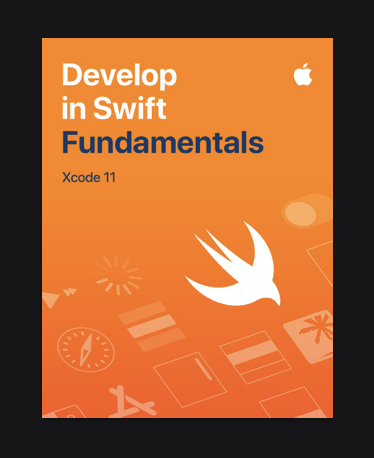
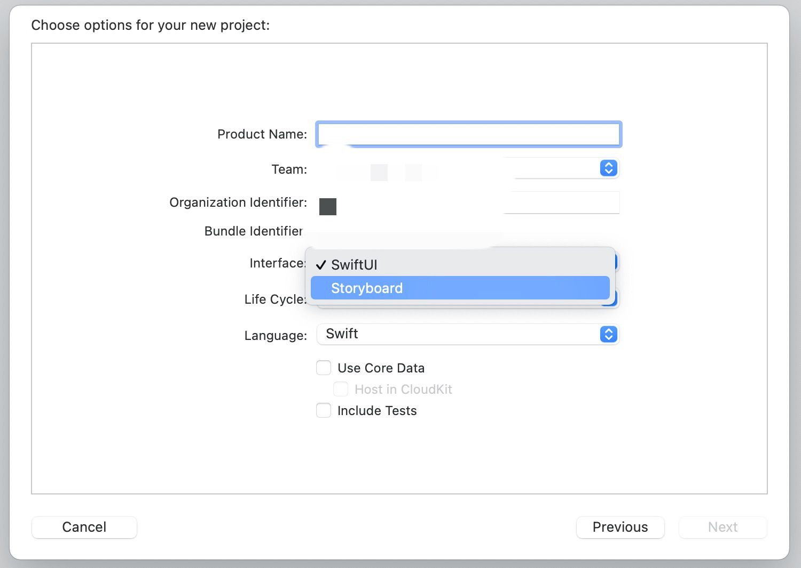

# Problem for iOS

Hi～，这是iOS组的二面题。

由于iOS应用只能在Mac OS上编译，所以选择本题必须拥有一台**运行着Mac OS的电脑**。

Xcode是苹果公司向开发人员提供的集成开发环境，是开发Mac OS、iOS应用程序最快捷的方式。请确保你的电脑上能够安装最新版本的Xcode。

## 题目要求

1. 本题需要你编写一个简单的iOS app，也许进行iOS开发并非易事，所幸的是苹果提供了很好的教材，使入门变得不再困难。

2. 在Apple的图书商店中找到*Develop in Swift Fundamentals*这本书并下载。（需要一个外区的Apple ID）

   

3. 阅读这本书的第一章，在这章中你会学到Swift的基本语法、Xcode的基本使用方法以及如何创建一个APP。请完成这章中的**Guided Project—Light**，**上传XCode工程文件夹**。

   

Hint：如果你发现初始的项目文件结构和书上的不一样，可能需要在创建项目时把Interface选项改成Storyboard。

